# Workshop-3 - Automatización y Control de Procesos

## Integrantes 

Tomas Candelo Montoya

Carlos Farouk Abdalá Rincón

**** 
## Diseño del circuito lógico para el proceso automatizado 

En este documento exploraremos el proceso de desarrollo que se siguió para llegar a la solución final para un proceso de autorregulación de un tanque donde tenemos 3 sensores a lo largo de este, con base a las señales dadas por estos sensores de entrada, el sistema informara de la situación del agua en el tanque para que los trabajadores de la planta puedan reaccionar y tomar decisiones frente a esto. 

Una vez definido el proceso el diseño, pasamos a la etapa del diseño lógico de la solución, para esto podemos determinar que el sistema sigue una lógica combinatoria, donde las diferentes combinaciones de entradas, generan diferentes respuestas en las salidas del mismo, por lo que para realizar el diseño de la lógica lo primero fue definir claramente cuales son las entradas y salidas que se ven involucradas en el proceso.
- Sensor que se encuentra en la parte baja del tanque **(input)**
- Sensor que se encuentra en la altura minima a la que debería estar el tanque  **(input)**
- Sensor que se encuentra en la parte superior del tanque **(input)**
- Indicador de éxito en el nivel del tanque **(output)**
- Indicador de que el nivel del tanque esta bajo **(output)**
- Indicador de que el nivel del tanque esta muy alto **(output)**
- Indicador de que el tanque esta vacío **(output)**
- Indicador de que hay un error en la medición del tanque **(output)**

### Diseño Lógico 

Con las entradas y salidas determinadas, el siguiente paso fue realizar una tabla de verdad, esto fue nuestra base para realizar la lógica combinacional del sistema, ya que este es el método adecuado para realizar el diagrama lógico. 

La tabla de verdad resultante fue la siguiente: 

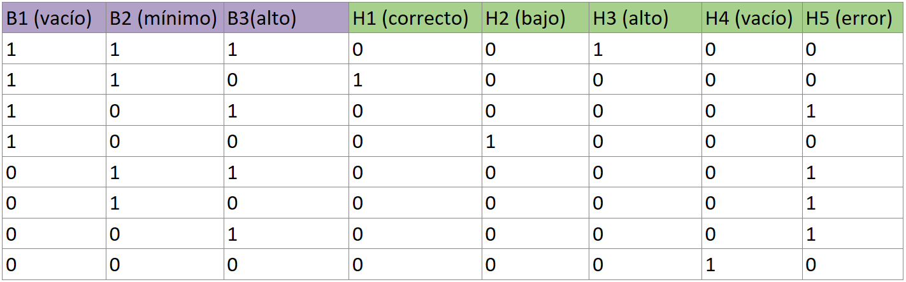

aca podemos ver los 5 posibles casos: 
- El tanque esta en el nivel de agua adecuado: **Sensor 1 y 2** enviando señal
- El tanque tiene un nivel de agua muy bajo: **Sensor 1** enviando señal
- El tanque tiene un nivel de agua muy alto: **Los 3 sensores** envían señal 
- El tanque esta vacío: **Ningún sensor** envía señal 
- El tanque presenta un error: **Combinación de sensores que no tiene sentido (solo 2, solo 3, 1 y 3 o 2 y 3)** envían señal

Con la tabla de verdad podemos obtener las funciones que representan cada uno de los casos según que condiciones tienen en la entrada, los primeros 4 casos dan funciones directas ya que unicamente existe una configuración que dará la salida deseada, mientras que para el caso de error se tienen que evaluar 4 diferentes combinaciones de condiciones iniciales para dar con el output deseado, las funciones con compuertas lógicas quedarían de esta manera:

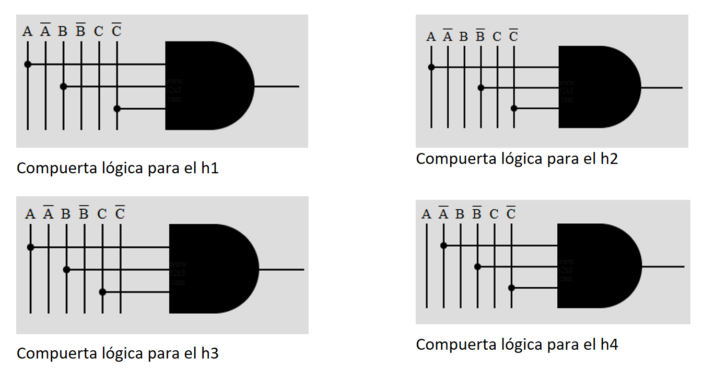

Cabe resaltar que estas funciones fueron obtenidas con el apoyo de la pagina web 32x8, proporcionada por el profesor, a excepción de la función para los casos de error esto debido a que como grupo tomamos la decisión de implementar esta función de una manera diferente a la que probablemente usarÍan los demás equipos de trabajo. 

En este caso lo que se hizo fue calcular los posibles casos a mano y a partir de ahi simplificar para obtener una nueva lógica que cumpliese con la misma función, la nueva función a implementar en los casos de errores es la siguiente: 

>$$ B_2 ( \overline{B_1} B_3 + \overline{B_1} \overline{B_3}) + \overline{B_2} (B_1 B_3 + \overline{B_1} B_3)$$

### Diseño Ladder

Ahora con las funciones representadas en compuertas lógicas, podemos "traducir" estas compuertas a rieles y contactos para representar el sistema en una lógica Ladder, para esto utilizamos los conocimientos vistos en clase sobre como es la representación de una compuerta AND, OR y XOR, que son las 3 compuertas lógicas usadas, en lenguaje Ladder. El diseño fue implementado en CodeSys para hacer el primer diseño de este y la simulación del HMI.

## Implementación en CodeSys

Con el diseño Ladder listo pasamos al siguiente paso del workshop el cual consiste en la implementación y simulación de nuestro diseño en el software de CodeSys, para este apartado se realizaron dos actividades principales, realizar el esquemático Ladder y realizar un HMI que represente como seria la interacción con este sistema automatizado. 

### Esquemático Ladder del diseño

Primero, una vez estamos en el software, en el plano de PLC_PRG se añadió un primer contacto para asi poder cerrar las variables globales que serán necesarias para la implementación del diseño, ademas de las ya mencionadas anteriormente aquí se crearon variables adicionales que serán necesarias para la implementación y simulación del diseño 
- **Variable START:** Esta sera usada para dar inicio como tal al proceso de medición del nivel de agua 
- **Variable STOP:** Esta sera usada para detener el proceso cuando este en ejecución 
- **Variable IR_1:** Este es un relé que se utilizo para guardar el estado del sistema cuando este inicie, si este relé se encuentra activo permitirá que el sistema de indicadores se mantenga activo hasta que se accione el botón de stop. 

Una vez se crearon las variables se construyo el esquemático en forma, para este se realizaron un total de 6 redes diferentes, una para el funcionamiento del inicio y parada del sistema y las otras 5 para cada uno de los casos de los indicadores. 

En la primer red simplemente se hace el esquemático que se ve en la imagen 

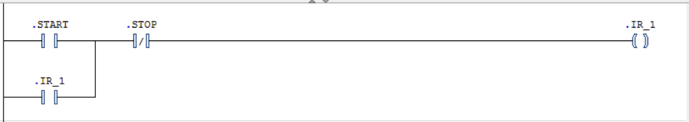

donde lo único a destacar es la retroalimentación del relé IR_1 que garantiza que el sistema se mantenga encendido hasta que se active el botón de parar.

Las siguientes 5 redes quedaron en el software como se ve en las siguientes imágenes:

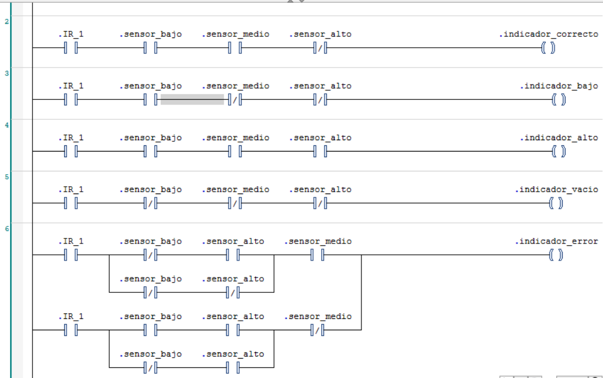

En todos estos casos el primer contacto que tienen es el del relé ya que con esto garantizamos que muestre los indicadores unicamente cuando el sistema esta activo, lo cual se trasporta a la vida real en el sentido de que a menos que la maquinaria este prendida, los sensores pueden seguir midiendo pero no serán procesados ni generaran una salida del sistema, ya que no esta activo este mismo. 

### simulación con un HMI 
una vez el esquemático del Ladder estaba listo, se añadió un objeto de visualización para el diseño de la simulación con uso de un HMI (Human-Machine interface) el cual consiste en una interfaz que permita demostrar como seria la interacción humano maquina para el sistema que se desea implementar o simular. 

Como el sistema que se desarrollo consistía en el control del nivel de agua en un tanque, lo que optamos a desarrollar como HMI seria un conjunto de figuras que se asimilara a un panel de control de una fabrica en el centro de control de la misma. 

El resultado final del HMI fue el siguiente: 

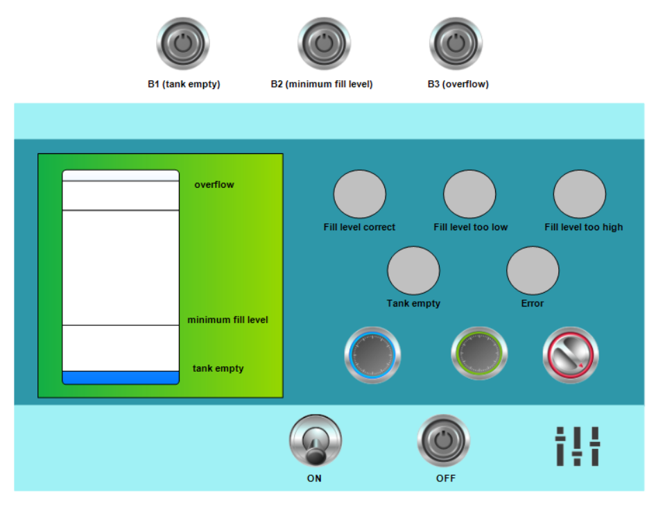

En este podemos ver una semejanza a los centros de control de una fabrica, donde tenemos una visualización del tanque a las izquierda y los indicadores a la derecha, en la parte inferior del panel tenemos la palanca que activa el sistema y el botón de pausa, fuera de este panel de control encontramos 3 botos los cuales representaran los sensores del tanque, puesto que este software no cuenta con sensores para simular el proceso. 

En la visualización del tanque lo que se hizo fue una animación de los diferentes niveles de agua que puede llegar a tomar el tanque en función de lo que esta midiendo el sensor, para dar una representación visual de cual es el estado actual que tiene el tanque al momento de la medición, además de representar de mejor manera los casos donde se presenta un error en el mismo, cabe resaltar que estos cambios en el tanque se pueden ver aunque no este encendido el sistema, esto ya que, en la vida real, los tanques y elementos de un sistema siguen trabajando y funcionando aunque su control automatizado este apagado, sin embargo, los indicadores claramente no están activos hasta que se active la solución. 

Una vez creada esta interfaz y la animación del tanque lo ultimo que se realizo previo a la prueba fue la asignación de variables a los diferentes elementos del sistema. Los 3 botones de arriba como ya fue mencionado, son los que representaran los sensores del tanque permitiendo que puedan ser activados o desactivados según la condición que se le quiera dar al sistema. Los indicadores por otro lado, fueron representados en los círculos grises donde, cuando se daban las condiciones de entrada adecuadas, se cambiaba el color según lo que se deseara informar a los operadores frente al funcionamiento del tanque.

Con todo listo se realizo la simulación del CodeSys con el HMI y los resultados obtenidos fueron los siguientes:

## Implementación del sistema en OpenPLC

Una ves desarrollamos y comprobamos el diseño en CodeSys, pasamos al desarrollo del sistema en el software de openPLC, esto con dos fines, el primero realizar nuevamente una prueba y validación del funcionamiento del sistema e implementar el sistema en un prototipo físico para probar y demostrar el funcionamiento del mismo con componentes reales. 

### Diagrama Ladder 

Primero que nada tuvimos que replicar el diagrama Ladder en openPLC para posteriormente hacer uso de el en las siguientes pruebas, para implementarlo se realizo el mismo proceso que en CodeSys con la diferencia de que en este software todos los contactos van al mismo riel.

Se crearon las variables y luego fueron asignadas según correspondía a la lógica a implementar, Finalmente el diagrama Ladder del sistema que integra todas las condiciones en un solo riel fue el siguiente:

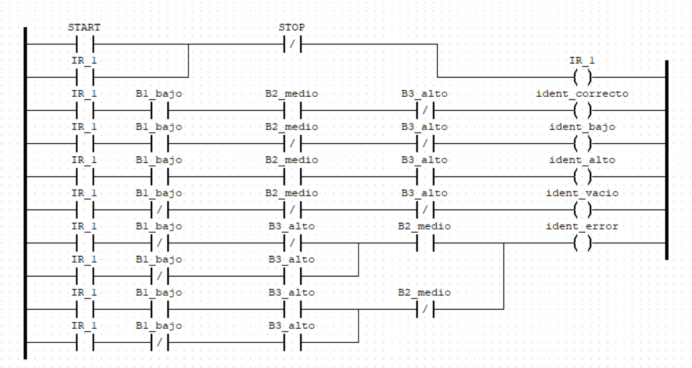

Con el diagrama creado se realizo una nueva simulación forzando los valores de **True** o **False** en los contactos con el único fin de verificar que la implementación en openPLC se haya realizado correctamente, en este caso todo cuando de acuerdo a lo establecido.

# Validación con Equipo Real y OpenPLC
Ya teniendo el sistema montado en ladder en la aplicación OpenPLC, podemos simularlo en el sistema que nos ofrece la misma aplicación, a continuación una muestra de la simulación.

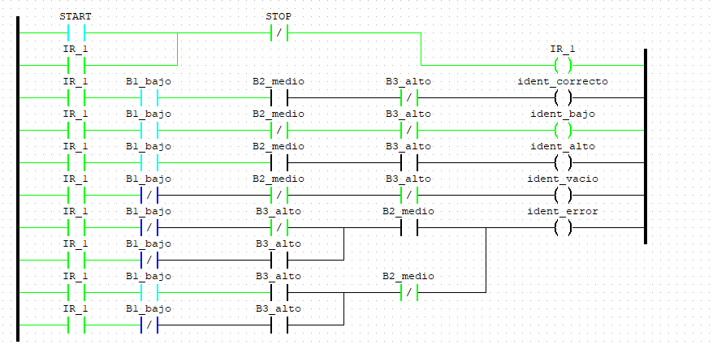

De esta forma podemos validar el correcto funcionamiento del sistema implementado, cambiando las diferentes entradas del sistema dinámicamente para verificar que se cumplan los requerimientos solicitados.

Sin embargo, es necesario realizar configuraciones adicionales para poder asegurar el correcto funcionamiento del sistema para una posible aplicación en equipo real y tangible.

Primeramente es necesario conseguir un microcontrolador adecuado que nos permita subir el programa generado por la aplicación OpenPLC a su sistema. Para esto decidimos hacer uso de un Arduino Uno  que cuenta con el chip microcontrolador ATMEGA328P, esto debido a la compatibilidad del Arduino y del chip con OpenPLC y al manejo previo del equipo con este dispositivo.

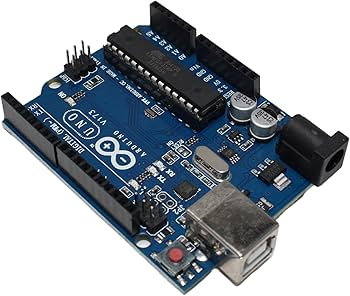

*Recuperado de https://www.amazon.in/Lalitha%C2%AE-R3-ATmega328P-Microcontroller-Prototyping/dp/B0DBGNN9RZ*

Es necesario tener en cuenta que el sistema además de cumplir con la compatibilidad requerida por OpenPLC, cumpla con los requerimientos que como equipo necesitamos para poder desarrollar e implementar el sistema de manera correcta. Es necesario recordar que como ya se menciono anteriormente, el sistema usará unicamente salidas yu entradas digitales debido a el comportamiento esperado del sistema, sin embargo hay que diferenciar tanto entradas como salidas para una mejor organización.

Se planea manejar las siguientes entradas con sus respectivas variables:

- **Nivel de agua bajo:** B1_bajo
- **Nivel de agua medio:** B2_medio
- **Nivel de agua alto:** B3_alto
- **Botón de inicio de sistema:** START
- **Botón de parada de sistema:** STOP

De igual manera, se debe planear el uso de salidas:

- **Señal indicativa de nivel de agua correcto:** ident_correcto
- **Señal indicativa de nivel de agua bajo:** ident_bajo
- **Señal indicativa de nivel de agua alto:** ident_alto
- **Señal indicativa de falta de agua:** ident_vacio
- **Señal indicativa de irregularidades en señales de agua:** ident_error

Se puede ver que necesitamos cinco entradas y cinco salidas digitales, podemos buscar en el datasheet del Arduino Uno las disposición de los pines que cumplen con lo requerido:

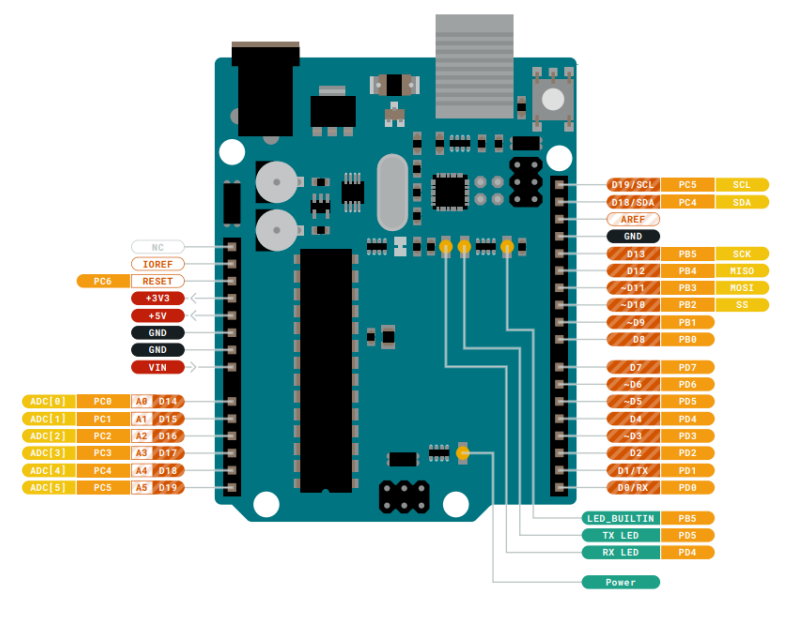
*Recuperado de https://docs.arduino.cc/resources/datasheets/A000066-datasheet.pdf*

Podemos ver que contamos con 14 pines que naturalmente se manejan de manera digital por lo que se cumple con los que se requiere.

### Configuración OpenPLC

A continuación se deben configurar la disposición de entradas y salidas del sistema en la tabla de variables que nos da OpenPLC, para esto podemos tomar como ejemplo una implementación que se encuentra en la documentación de OpenPLC [2] para entender como disponer la ubicación de las variables creadas en el Arduino para que todo el sistema funcione de manera correcta.

Teniendo en cuenta lo anterior, se debe asignar la ubicación valida de cada variable. Las variables contaran en la implementación con un led cada una que nos indique de manera visual el comportamiento del sistema. La disposición de las variables será la siguiente:

| Variable        | Ubicación     | Pin           | Color     |
| -------------   | ------------- | ------------- | ----------|
| B1_bajo         | %IX0.0        | 2             | Azul      |
| B2_medio        | %IX0.1        | 3             | Azul      |
| B3_alto         | %IX0.2        | 4             | Azul      |
| START           | %IX0.3        | 5             | Verde     |
| STOP            | %IX0.4        | 6             | Rojo      |
| ident_correcto  | %QX0.0        | 7             | Verde     |
| ident_bajo      | %QX0.1        | 8             | Amarillo  |
| ident_alto      | %QX0.2        | 9             | Rojo      |
| ident_vacio     | %QX0.3        | 12            | Azul      |
| ident_error     | %QX0.4        | 13            | Rojo      |

Teniendo en cuenta que los valores después del punto en la ubicación corresponde al indice de la lista de entradas y salidas que veremos más adelante.

A continuación se debe usar la opción de Transferir Programa a PLC que nos ofrece la aplicación:

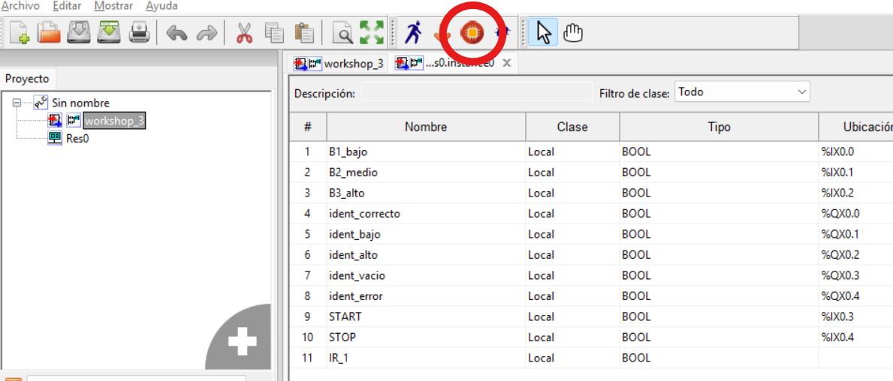

Se nos abrirá e la que se deberá seleccionar el sistema de Hardware que se vaya a usar, en este caso el Arduino UNO y el puerto USB en el que se encuentra conectado. Seguido, deberemos configurar correctamente la lista de pines de entrada y salidas digitales, es decir, la lista que se menciono anteriormente, esto se configura en la sección "I/O Config":

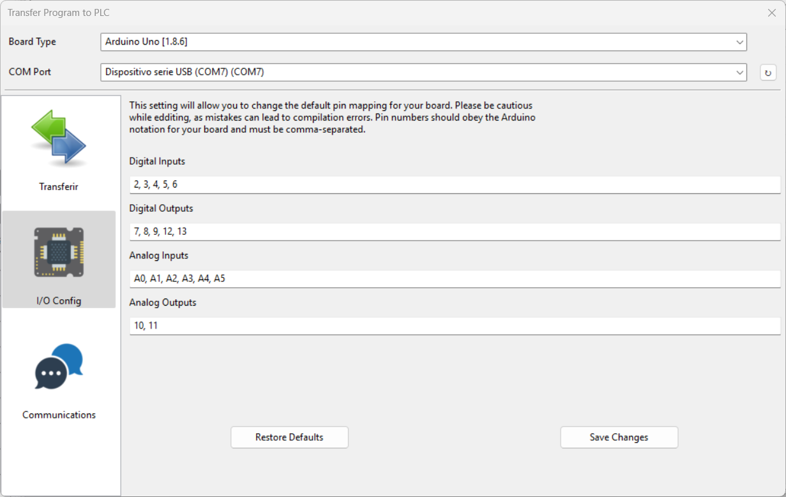

Con las configuraciones ya dispuestas, le debemos dar a la opción
"Transfer to PLC" que encontraremos en la sección "Transferir". Esto subirá el software de nuestro sistema al chip microcontrolador que se encuentra en el Arduino, configurando de esta manera el sistema para poder hacer pruebas. Si todo esta bien, en la consola debería terminar la ejecución con el mensaje "Done":

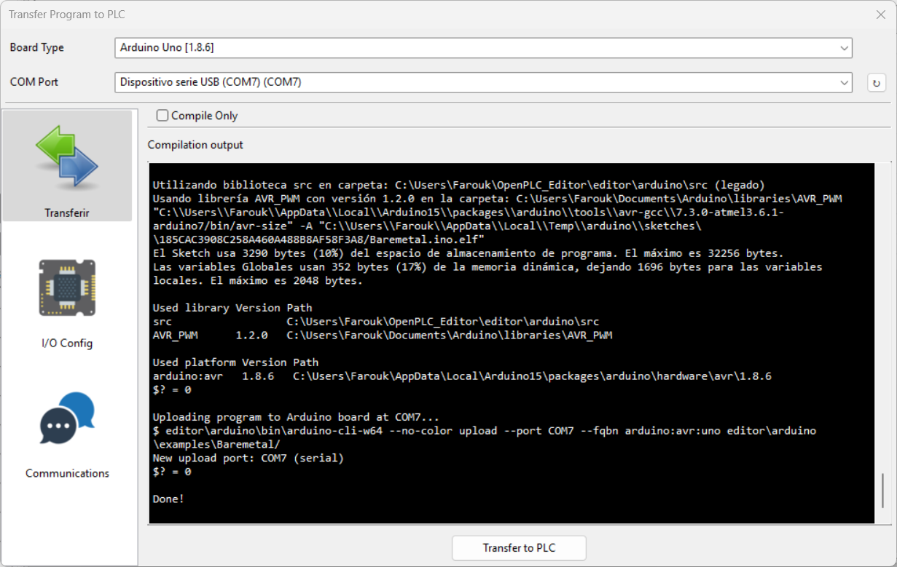

### Montaje Físico

Para un primer montaje, se hizo uso de una pequeña protoboard que funcionara para colocar todos los elementos necesarios. Si bien se hará uso de switches que permitan modificar y dar los estados necesarios para que el sistema funcione, inicialmente se harán las pruebas con la alimentación del sistema para garantizar que si se presenta algún falló no sea por algún componente defectuoso, esto se estableció tras realizar pruebas con switches que debido a su disposición generaron ruido, modificando los resultados esperados. La alimentación que se usará será la brindad por los pines 5V y GND del Arduino. La disposición del sistema es la siguiente:

A continuación, las muestras de los diferentes estados del sistema e el montaje físico inicial:

#### Sistema Encendido - Nivel de Agua: Vacío
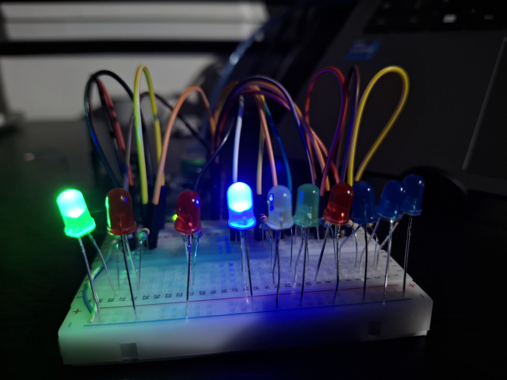
#### Sistema Encendido - Nivel de Agua: Bajo
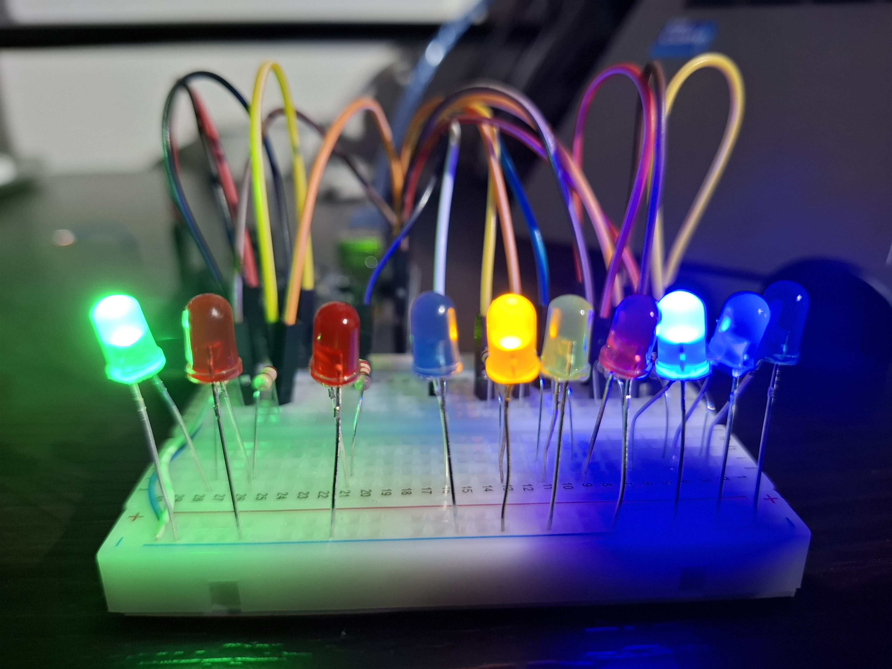
#### Sistema Encendido - Nivel de Agua: Medio (Correcto)
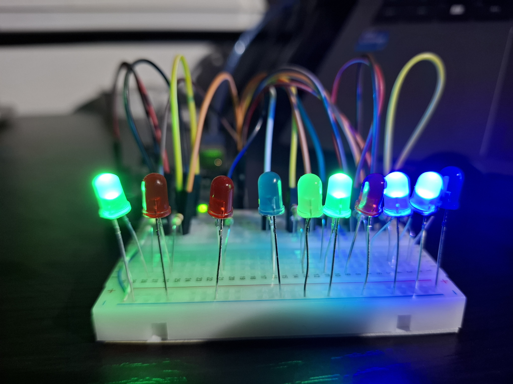
#### Sistema Encendido - Nivel de Agua: Alto
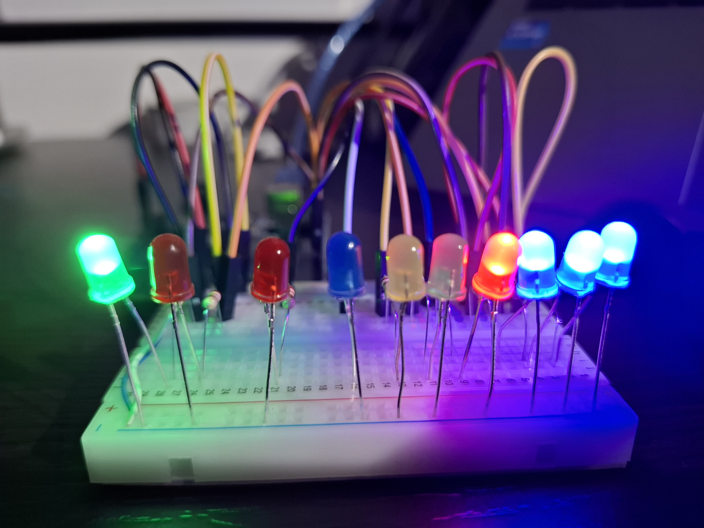
#### Sistema Encendido - Nivel de Agua: Sin Sentido
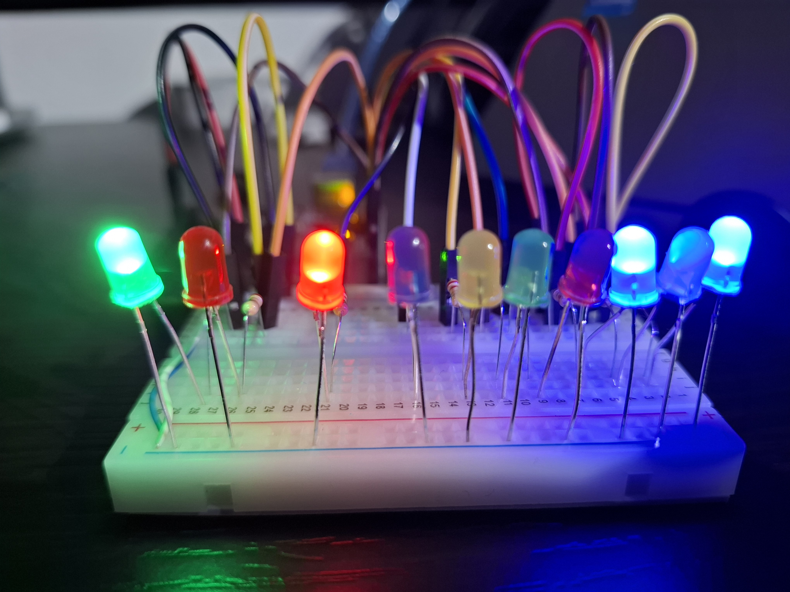
#### Sistema Parado
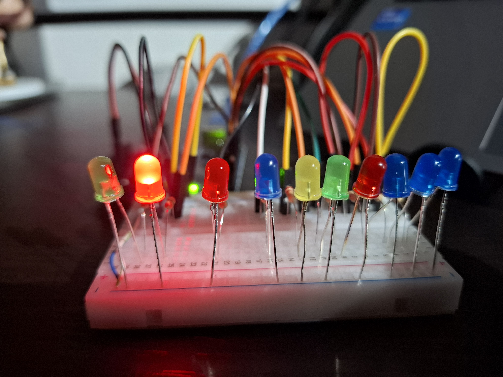

## Montaje Final

Tras realizar todas las pruebas pertinentes, se realizo un diseño que cumpla y represente de manera correcta el contexto y funcionamiento del sistema. Para ello, lo primero que se hizo fue reemplazar los cables que mandaban señales directas al Arduino yas sea desde positivo (1), o desde negativo (0) por deep switches que permitieran dar estas señales únicamente cambiando el estado de los respectivos switches. Se implementó undo de dos entradas para el manejo de encendido y apagado y uno de cuatro para las entradas de bajo, correcto y lleno del tanque que serian las que al fin y al cabo determinarían el comportamiento del sistema.

Se diseño una carcasa que simulara un sistema de monitoreo desde una pequeña consola y que desde esta se pudiera encender y apagar el sistema y manipular los diferentes niveles de agua haciendo uso de los switches ya mencionados. 

El resultado fue el siguiente:

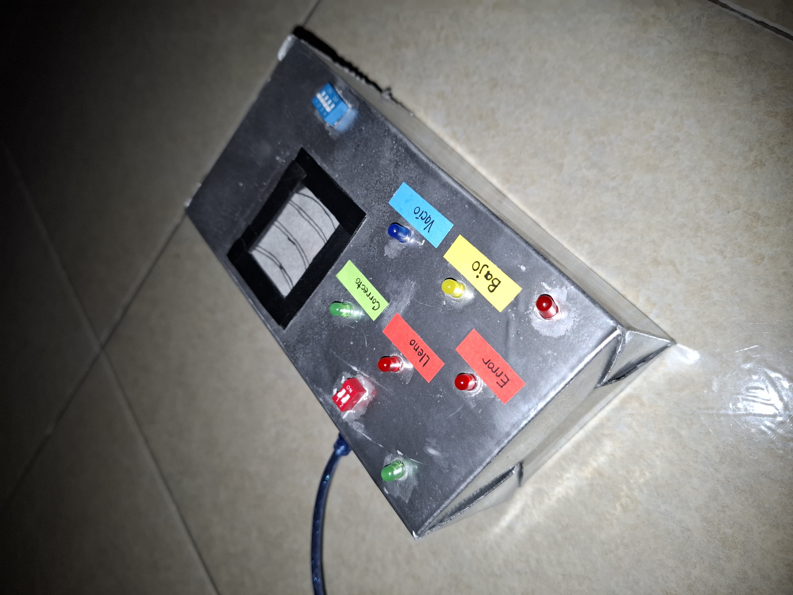

Se puede ver que se cuentan con todos los leds encargados de mostrar los estados del sistema además de dos que muestren si el sistema se encuentra encendido o apagado. Se diseño una representación gráfica del sistema de agua que diera la ilusión de que el tanque de agua se va llenando de acuerdo a como se encuentre el estado de los switches. A continuación un video explicativo del funcionamiento de este montaje final.

## Referencias  

[1] Arduino, "Arduino Uno Rev3 Datasheet," 2016. [Online]. Available: [https://docs.arduino.cc/resources/datasheets/A000066-datasheet.pdf](https://docs.arduino.cc/resources/datasheets/A000066-datasheet.pdf). [Accessed: 23-Mar-2025].  

[2] Autonomy Logic, "Creating Your First Project on OpenPLC Editor," 2023. [Online]. Available: [https://autonomylogic.com/docs/3-2-creating-your-first-project-on-openplc-editor/](https://autonomylogic.com/docs/3-2-creating-your-first-project-on-openplc-editor/). [Accessed: 23-Mar-2025].  

